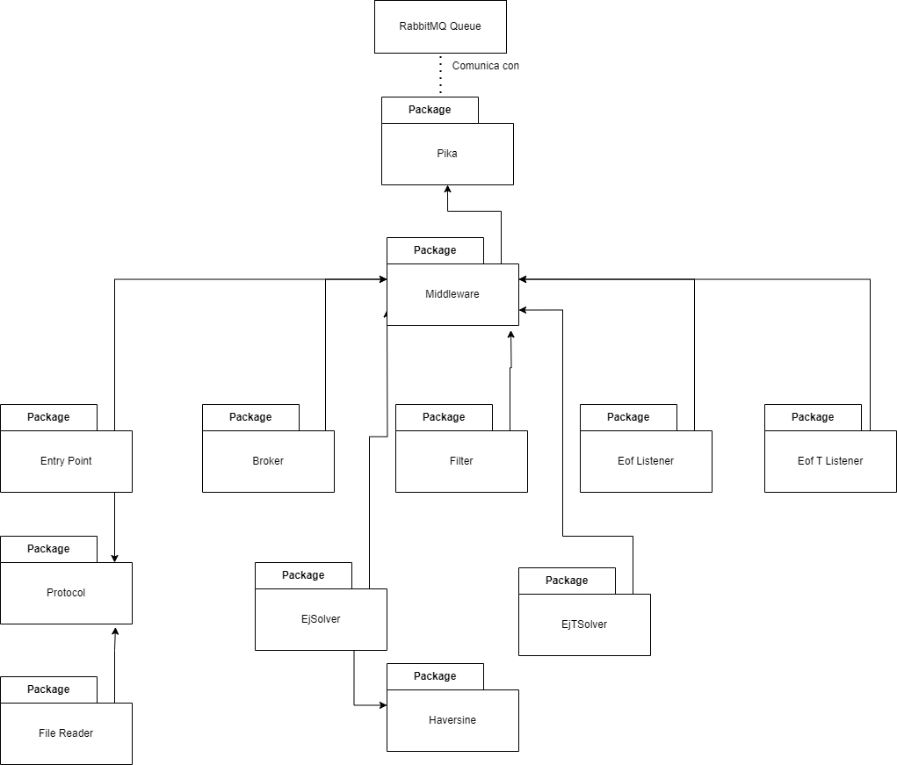

# DistribuidosI-TP1
Trabajo practico 1 de 75.74 Sistemas Distribuidos I - FIUBA

## Ejecución

### Inicio

Para generar un archivo de docker compose con replicas se provee un script en la carpeta scripts que puede ejecutarse con "phython3 generate_docker_compose.py". En el archivo config.ini se puede indicar cuantas replicas quieren generarse de cada entidad. Se debe ejecutar el script python desde adentro de la carpeta de scripts.

No se incluyen los archivos de datos. Debe descargarse el zip y guardar las carpetas montreal, toronto y washington en una carpeta llamada .data en la raiz del proyecto.

### Configuración

Para poder ejecutar el sistema completo se provee un archivo de Makefile y un archivo de docker.compose (tambien puede generarse el propio como se indico previamente). Para levantar el sistema se debe ejecutar "make docker-compose-up" y luego "make docker-compose-logs" para poder ir viendo los logs del sistema. Cada entidad en ejecución loggea cierta data que permite comprender el estado del sistema al momento de loggeear. La entidad FileReader, al obtener los resultados, los loggeara por pantalla. Para poder apagar el sistema se debe ejecutar "make docker-compose-down".

## 4 + 1 Views

### Scope

Se solicita un sistema distribuido que analice los registros de viajes realizados con bicicletas de la red pública provista por grandes ciudades. Los registros cuentan con el tiempo de duración del viaje, estación de inicio y de fin. Se posee también lat., long. y nombre de las estaciones así como la cantidad de precipitaciones del día del viaje. 

Se debe obtener: 
1) La duración promedio de viajes que iniciaron en días con precipitaciones >30mm.
2) Los nombres de estaciones que al menos duplicaron la cantidad de viajes iniciados en ellas entre 2016 y el 2017. 
3) Los nombres de estaciones de Montreal para la que el promedio de los ciclistas recorren más de 6km en llegar a ellas.

Esto queda modelado con el siguiente diagrama de casos de uso:

**Supuestos**

Se toma la suposición de que el cliente enviara primero weathers, luego stations y finalmente trips. No enviara datos de diferentes topicos mezclados, es decir mandara todo de un mismo tipo antes de pasar al siguiente. El sistema soporta una unica ejecución, y luego finaliza. No se puede ejecutar mas de una vez sin reiniciar el sistema.

**Desarrollo**

Para el presente trabajo se usaron las siguientes tecnologias:

- Python3
- Docker
- RabbitMQ (lib pika)
- lib Haversine

### Software Architecture

La estructura del sistema se encuentra separada en entidades que se comunican entre si cuando es necesario. Hay entidades replicables y entidades no replicables. Las entidades son las siguientes:

- File Reader: es el cliente del sistema, enviara los archivos del dataset por etapas. Luego esperara que el servidor le envie los resultados para mostrarlos por pantalla.
- Entry point: recibe los envios del cliente y dependiendo el topico se lo envia a cada broker correspondiente. Luego espera que el cliente le informe que finalizo de enviar un topico con un EOF, y cuando el topico sea viajes, esperara los resultados. Una vez que reciba los resultados se los enviara al cliente y finalizara la conexión y ejecución.
- Broker: tiene un topico asociado, recibe los batches de rows de ese topico y se los envia a los filters correspondientes, solamente las columnas que necesita cada filter. Si recibe un EOF, se lo reenvia a la entidad EOFListener con su nombre y se apaga.
- Filter: tiene un topico y un ejercicio asociado, recibe las rows y dependiendo cual topico y ejercicio tiene asociada filtra los que no sean necesarios. Luego envia las rows filtradas al EjTripsSolver asociado a su ejercicio.
- EjTripsSolver: tiene un ejercicio asociado, recibe las rows filtradas y las procesa para ir calculando resultados parciales. Cuando se procesaron todos los trips, envia lo resultados parciales al EjSolver asociado.
- EjSolver: tiene un ejercicio asociado y recibe los resultados parciales de sus EjTripsSolver asociados, una vez que tiene todos los joinea para calcular los resultados finales. Cuando tiene los resultados finales los envia al Entry Point para que se los envie al cliente.
- EofListener: recibe los EOF de los brokers y cuando tiene todos los EOF de los brokers de un topico, se lo informa a los filters de ese topico para que propaguen el EOF y puedan apagarse.
- EofTripsListener: recibe los EOF de los filters de trips y cuando tiene todos se los envia a los EjTripsSolver para que envien sus resultados parciales al EjSolver asociado.

Las entidades replicables son los filtros, los brokers y los EjTripSsolvers. El resto de las entidades no son replicables y no deben replicarse para evitar un funcionamiento incorrecto del sistema. Las entidades replicables son aquellas que consumiran y procesaran la data. En un entorno productivo podrian replicarse correctamente para escalar el sistema.

### Architectural Goals & Constraints

- Distribuir el procesamiento, envio y recepción de mensajes en unidades pequeñas y escalables.
- Utilizar un sistema de mensajeria, RabbitMQ, para comunicar las distintas entidades de forma prolija y eficiente.
- Encapsular la comunicación en un middleware como capa de abstracción que oculte la complejidad y asi lograr separar la logica del negocio de la comunicación.

### Logical View

Los siguientes diagramas DAGs explican en cada caso de uso como es el flujo de datos.

### Process View

**Diagramas de actividades**

A continuación se presentan algunos diagramas de actividades que ayudan a entender como interactuan las entidades del sistema, considerando N como cantidad de replicas de los filters y M como la cantidad de replicas de los Brokers.

El siguiente diagrama ilustra como se envia la data desde que se recibe en el entry point hasta el Solver para poder almacenarla o usarla para resolver una query. Se muestra el caso de weather pero todos los casos siguen la misma logica:

El siguiente diagrama ilustra como funciona la entidad EOF Listener. El caso mostrado es el envio de stations, pero el funcionamiento para weathers y trips es analogo:

Este diagrama muestra como se envia la data desde el cliente hacia el servidor. El caso de ejemplo es con trips pero podria ser igual con estaciones o climas:

Este diagrama muestra como se van resolviendo parcialmente las querys de cada ejercicio. Cada uno de esos EjTsolvers esta replicado y le enviaran a su EjSolver asociado la info parcial para que la joinee y calcule los resultados finales:

**Diagramas de Secuencia**

---

### Development View

Cada entidad, a excepcion del file reader, posee un Middleware para comunicarse con el resto de las entidades. El middleware de cada entidad hereda de una clase Middleware global que posee las funciones propias de RabbitMQ. Este Middleware global usa la libreria pika para implementar la comunicación.

A continuación se detalla como funciona el sistema a grandes rasgos.

El cliente, llamado FileReader enviara los archivos del dataset por etapas. Primero mandara todos los archivos de weathers, luego todos los archivos de estaciones, y por ultimo los archivos de viajes. Luego de enviar cada seccion de archivos enviara un mensaje de EOF y esperara que el servidor le confirme que han sido recibidos y procesados correctamente. Luego esperara que dicho servidor le envie los resultados para mostrarlos por pantalla. El cliente lee los archivos y manda al servidor en batches de N rows, configurable en archivo config.ini, usando un protocolo.

El servidor por su parte escucha mensajes via socket en una entidad llamda Entry Point. Una vez que recibe un batch de rows, revisa que topico es y luego se las envia a un broker correspondiente. A partir de aqui todas las comunicaciones entre entidades del servidor seran a partir de RabbitMQ. Una vez que el cliente informo que finalizo de enviar un topico con un EOF, el servidor propagara el EOF a los brokers y esperara la confirmación de que todas las entidades ya procesaron dicho topico, y cuando el topico sea viajes, esperara los resultados. Una vez que reciba los resultados se los enviara al cliente y finalizara la conexión y ejecución.

Hay tres tipos de brokers: weather, stations y trips, cada uno procesara el topico que se llame como el. Cada broker recibira el batch de rows y debera recorrerlo para poder enviarle a los filtes cada row individualmente de la manera que se detallara. Si el broker es de wheater, se le mandara cada row al filtro de wheaters para el Ej1, ya que es el unico que usa wheaters. El broker station le enviara las estaciones al filtro de estaciones para el Ej3, y tambien le enviara las estaciones al Ej2Solver, que necesita todas las estaciones para operar. Por ultimo el broker de trips le enviara cada trip al filtro de trips para ejercicio 2, al filtro de trips para ejercicio 3, y luego al Ej1Solver, que necesita todos los trips. Si un broker recibe un EOF, se lo reenvia a la entidad EOFListener con su nombre y se apaga. Cabe destacar que cuando los brokers le envian informacion a los filters o a los solvers, solo le envian las columnas de la row que estos vayan a necesitar, no le envian la row completa.

Hay 4 tipos de filters, filtro de wheaters para el Ej1, filtro de estaciones para el Ej3, filtro de trips para ejercicio 2 y filtro de trips para ejercicio 3 (WE1, SE3, TE2, TE3, respectivamente). WE1 recibe weathers y se lo envia al Ej1Solver si la precipitacion es mayor a 30mm. SE3 recibe estaciones y se las envia a Ej3Solver si la estacion es de Montreal. TE2 recibe info de trips y se los envia a Ejt2Solver si el viaje fue realizado en 2016 o 2017. TE3 recibe info de trips y se la envia a Ej3tSolver si el viaje fue en Montreal. Cuando un filtro WE1 o SE3 recibe un EOF, lo reenvia a su solver correspondiente. Cuando TE2 o TE3 recibe un EOF, lo envia a EOFTLISTENER. Luego se apagan.

El EOFListener cumple la función de una barrera distribuida: sabe cuantos brokers de cada tipo hay (replicas), y cuando todas le mandaron un EOF, propaga los EOFS para los filters correspondientes, asegurandose asi de que ningun EOF vaya a colarse antes que un paquete con información. Por ejemplo, si hay 50 replicas de Wheater Broker, espera 50 EOFs de wheater, y recien ahi le envia un EOF a cada replica del WE1 Filter (pone 50 en la cola, cada replica toma un eof y al leerlo se apaga), de esta forma se garantiza el orden de los EOFS.
El EOFTListener cumple la misma funcion pero entre los Filters y los EJTsolvers.

EjSolver espera a recibir todos los Weathers (sabe cuando recibio todos ya que cuenta los EOFS que le mandan los filters) y Ej2Solver y Ej3Solver esperan a recibir todos los Stations. Luego, antes de mandarle la confirmación al Entry Point, para que este a su vez le informe al cliente, le envian a sus EjTSolver asociados (a cada replica) la información que almacenaron. 

Los EjTSolvers, una vez que recibieron la información de su EjSolver asociado, escuchan la info de trips que les envian los filters. Una vez que reciben un trip, van calculando resultados parciales que van a servir para resolver las queries del enunciado. De esta forma pueden tomarse resultados parciales de forma distribuida. Al recibir un EOF, antes de finalizar le envian a su EjSolver asociado la data de resultados parciales que recibieron y acumularon.

Una vez que cada EjSolver recibio de todas las replicas de sus EjtSolver la información de los viajes, procede a hacer el join, calculando resultados finales a partir de los parciales, hasta obtener lo que pedia cada enunciado. Una vez que obtuvieron los resultados finales, se los envian al Entry Point y finalizan.

