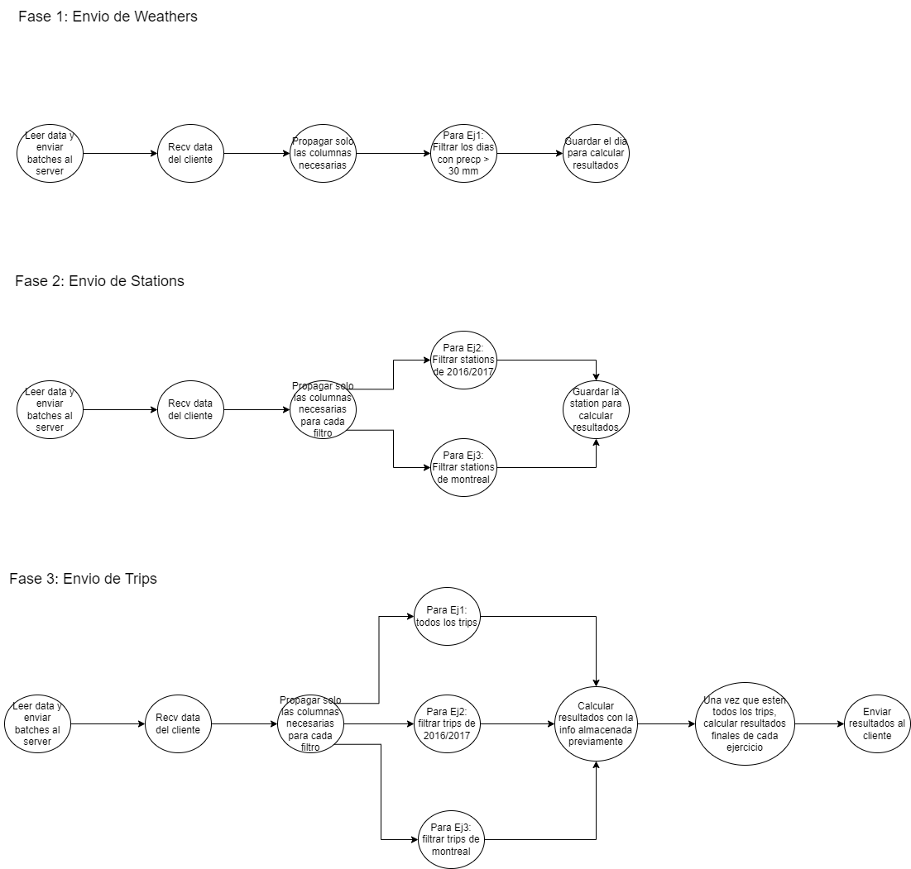

# DistribuidosI-TP1
Trabajo practico 1 de 75.74 Sistemas Distribuidos I - FIUBA

## Ejecución

### Configuración

Para generar un archivo de docker compose con replicas se provee un script en la carpeta scripts que puede ejecutarse con "phython3 generate_docker_compose.py". En el archivo config.ini se puede indicar cuantas replicas quieren generarse de cada entidad. Se debe ejecutar el script python desde adentro de la carpeta de scripts.

No se incluyen los archivos de datos. Debe descargarse el zip y guardar las carpetas montreal, toronto y washington en una carpeta llamada .data en la raiz del proyecto.

El cliente envia la data en batches de N rows. Este valor es configurable desde el archivo file_reader/config.ini. 

### Inicio

Para poder ejecutar el sistema completo se provee un archivo de Makefile y un archivo de docker.compose (tambien puede generarse el propio como se indico previamente). Para levantar el sistema se debe ejecutar "make docker-compose-up" y luego "make docker-compose-logs" para poder ir viendo los logs del sistema. Cada entidad en ejecución loggea cierta data que permite comprender el estado del sistema al momento de loggeear. La entidad FileReader, al obtener los resultados, los loggeara por pantalla. Para poder apagar el sistema se debe ejecutar "make docker-compose-down".

## 4 + 1 Views

### Scope

Se solicita un sistema distribuido que analice los registros de viajes realizados con bicicletas de la red pública provista por grandes ciudades. Los registros cuentan con el tiempo de duración del viaje, estación de inicio y de fin. Se posee también lat., long. y nombre de las estaciones así como la cantidad de precipitaciones del día del viaje. 

Se debe obtener: 
1) La duración promedio de viajes que iniciaron en días con precipitaciones >30mm.
2) Los nombres de estaciones que al menos duplicaron la cantidad de viajes iniciados en ellas entre 2016 y el 2017. 
3) Los nombres de estaciones de Montreal para la que el promedio de los ciclistas recorren más de 6km en llegar a ellas.

Esto queda modelado con el siguiente diagrama de casos de uso:

**Supuestos**

Se toma la suposición de que el cliente enviara primero weathers, luego stations y finalmente trips. No enviara datos de diferentes topicos mezclados, es decir mandara todo de un mismo tipo antes de pasar al siguiente. El sistema soporta una unica ejecución, y luego finaliza. No se puede ejecutar mas de una vez sin reiniciar el sistema.

**Desarrollo**

Para el presente trabajo se usaron las siguientes tecnologias:

- Python3
- Docker
- RabbitMQ (lib pika)
- lib Haversine

### Software Architecture

La estructura del sistema se encuentra separada en entidades que se comunican entre si cuando es necesario. Hay entidades replicables y entidades no replicables. Las entidades son las siguientes:

- File Reader: es el cliente del sistema, enviara los archivos del dataset por etapas. Luego esperara que el servidor le envie los resultados para mostrarlos por pantalla.
- Entry point: recibe los envios del cliente y dependiendo el topico se lo envia a cada broker correspondiente. Luego espera que el cliente le informe que finalizo de enviar un topico con un EOF, y cuando el topico sea viajes, esperara los resultados. Una vez que reciba los resultados se los enviara al cliente y finalizara la conexión y ejecución. Cuando reciba un EOF, se lo propagara a los brokers correspondientes. 
- Broker: tiene un topico asociado, recibe los batches de rows de ese topico y se los envia a los filters correspondientes, solamente las columnas que necesita cada filter. Si recibe un EOF, se lo reenvia a la entidad EOFListener con su nombre y se apaga.
- Filter: tiene un topico y un ejercicio asociado, recibe las rows y dependiendo cual topico y ejercicio tiene asociada filtra los que no sean necesarios. Luego envia las rows filtradas al EjTripsSolver asociado a su ejercicio.
- EjTripsSolver: tiene un ejercicio asociado, recibe las rows filtradas y las procesa para ir calculando resultados parciales de cada query. Cuando se procesaron todos los trips, envia lo resultados parciales al EjSolver asociado. Al ser replicables se pueden calcular resultados parciales de forma distribuida.
- EjSolver: tiene un ejercicio asociado y recibe los resultados parciales de sus EjTripsSolver asociados, una vez que tiene todos los joinea para calcular los resultados finales de su query. Cuando tiene los resultados finales los envia al Entry Point para que se los envie al cliente.
- EofListener: cumple la función de una barrera distribuida: recibe los EOF de los brokers y cuando tiene todos los EOF de los brokers de un topico, se lo informa a los filters de ese topico para que propaguen el EOF y puedan apagarse, asegurandose asi de que ningun EOF vaya a colarse antes que un paquete con información. .
- EofTripsListener: recibe los EOF de los filters de trips y cuando tiene todos se los envia a los EjTripsSolver para que envien sus resultados parciales al EjSolver asociado.

Las entidades replicables son los filtros, los brokers y los EjTripSsolvers. El resto de las entidades no son replicables y no deben replicarse para evitar un funcionamiento incorrecto del sistema. Las entidades replicables son aquellas que consumiran y procesaran la data. En un entorno productivo podrian replicarse correctamente para escalar el sistema.

**Protocolo de comunicación cliente/servidor**

Breve explicación del protocolo: primero se envian 4 bytes (siempre esa cantidad) con la cantidad de bytes que ocupara el mensaje que se enviara a continuación, y luego se envia dicho mensaje en paquetes de bytes de hasta 8kb. El protocolo contempla posibles short read y short write. Los mensajes estan compuestos por batches de rows de data y el formato es el siguiente: topic;eof(1/0);rows. Las rows estan separadas por un caracter de nueva linea. Las rows estan compuestas por columnas separadas por un caracter de coma.

El servidor, para agilizar la comunicación y simular un proceso de streaming, unicamente contestara un ack cuando reciba un mensaje de EOF, no con cada recepcion de batches de data. El cliente, por su parte, enviara unicamente un ack cuando reciba los resultados finales.

**Tipos de filters**

Hay 4 tipos de filters, filtro de wheaters para el Ej1 (WeatherEj1), filtro de estaciones para el Ej2 (StationsEj2), filtro de estaciones para el Ej3 (StationsEj3), filtro de trips para ejercicio 2 (TripsEj2) y filtro de trips para ejercicio 3 (TripsEj3). WeatherEj1 recibe weathers y se lo envia al Ej1TripsSolver si la precipitacion es mayor a 30mm. StationsEj2 recibe estaciones y se las envia a Ej2TripsSolver si el year id es 2016 o 2017. StationsEj3 recibe estaciones y se las envia a Ej3TripsSolver si la estacion es de Montreal. TripsEj2 recibe info de trips y se los envia a Ejt2Solver si el viaje fue realizado en 2016 o 2017. TripsEj3 recibe info de trips y se la envia a Ej3tSolver si el viaje fue en Montreal.

### Architectural Goals & Constraints

- Distribuir el procesamiento, envio y recepción de mensajes en unidades pequeñas y escalables.
- Utilizar un sistema de mensajeria, RabbitMQ, para comunicar las distintas entidades de forma prolija y eficiente.
- Encapsular la comunicación en un middleware como capa de abstracción que oculte la complejidad y asi lograr separar la logica del negocio de la comunicación.

### Logical View

Los siguientes diagramas DAGs explican en cada caso de uso como es el flujo de datos.

### Process View

**Diagramas de actividades**

A continuación se presentan algunos diagramas de actividades que ayudan a entender como interactuan las entidades del sistema, considerando N como cantidad de replicas de los filters y M como la cantidad de replicas de los Brokers.

El siguiente diagrama ilustra como se envia la data desde que se recibe en el entry point hasta el Solver para poder almacenarla o usarla para resolver una query. Se muestra el caso de weather pero todos los casos siguen la misma logica:

El siguiente diagrama ilustra como funciona la entidad EOF Listener. El caso mostrado es el envio de stations, pero el funcionamiento para weathers y trips es analogo:

Este diagrama muestra como se envia la data desde el cliente hacia el servidor. El caso de ejemplo es con trips pero podria ser igual con estaciones o climas:

Este diagrama muestra como se van resolviendo parcialmente las querys de cada ejercicio. Cada uno de esos EjTsolvers esta replicado y le enviaran a su EjSolver asociado la info parcial para que la joinee y calcule los resultados finales:

**Diagramas de Secuencia**

Se muestran a continuación diagramas de secuencia que ayudan a explicar ciertos casos de uso del sistema.

El primer diagrama de secuencia representa el envio de trips desde que llegan al entry point hasta el solver de trips del ej 3, quien los almacena.

El segundo diagrama muestra cuando a este solver de trips le llega el eof, le envia los resultados que almaceno al Ej3Solver, quien espera a que todas las replicas le hayan enviado sus parciales, los joinea y los devuelve.

### Development View

Cada entidad, a excepcion del file reader, posee un Middleware para comunicarse con el resto de las entidades. El middleware de cada entidad hereda de una clase Middleware global que posee las funciones propias de RabbitMQ. Este Middleware global usa la libreria pika para implementar la comunicación. Se utiliza la entidad broker como ejemplo pero el resto de las entidades del servidor son analogas.

La entidad file reader no posee un middleware ya que no usa rabbit, pero si utiliza un protocolo para comunicarse con el servidor.

Por su parte, la entidad Entry Point posee tanto un middleware propio como un protocolo para comunicarse con el cliente.

### Physical View

Se expone la arquitectura del sistema mediante los siguientes diagramas de robustez (separado por fases de funcionamiento del sistema para mayor entendimiento).

Cada módulo se encuentra desplegado en un contenedor individual de docker permitiendo de esta manera su escalabilidad. El sistema entero se encuentra comunicado a traves de una instancia de Rabbit MQ, conocida por todos. A continuación se presenta el diagrama de despliegue:

